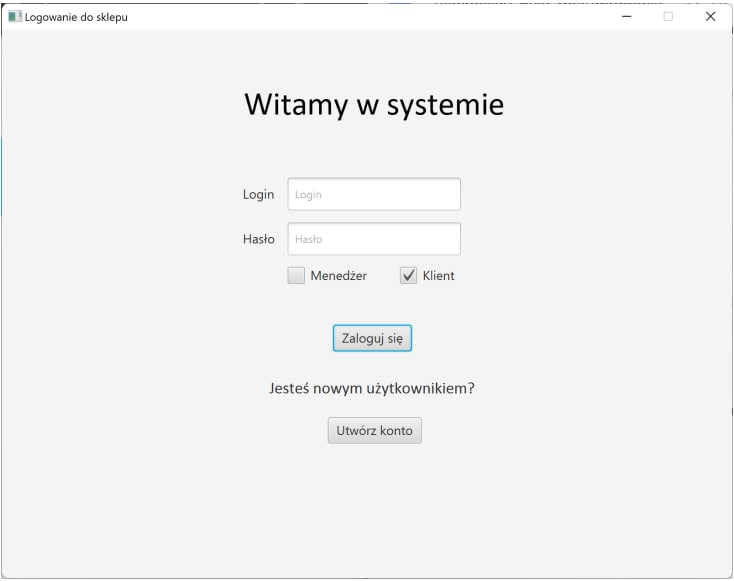
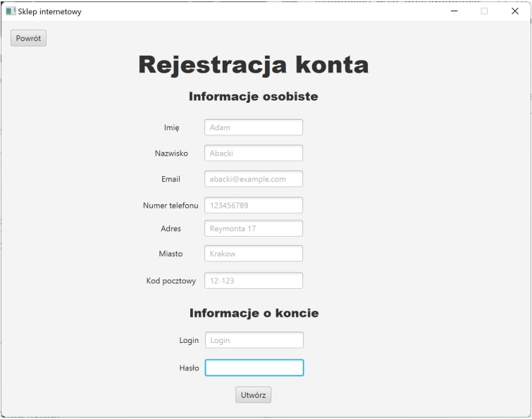
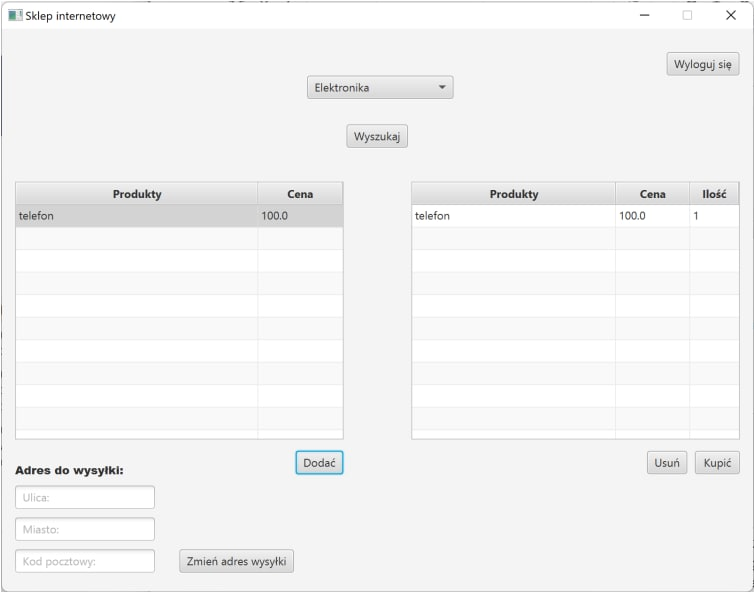
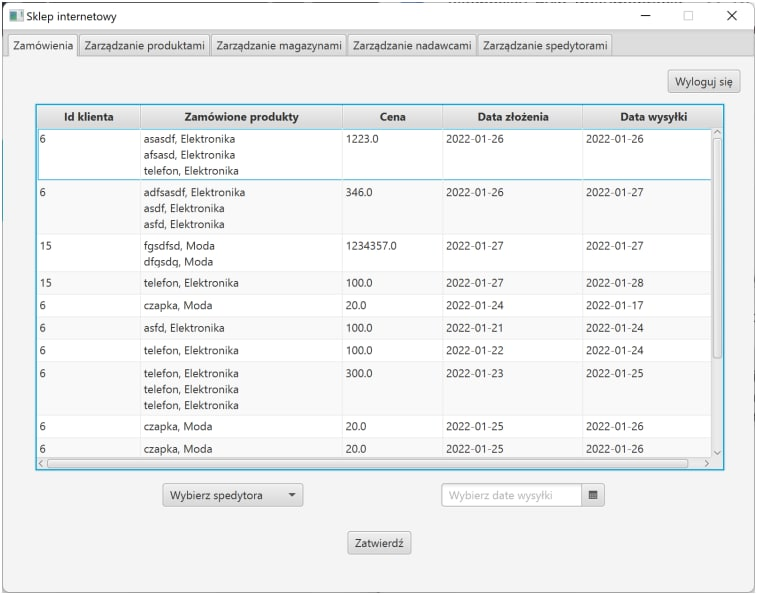
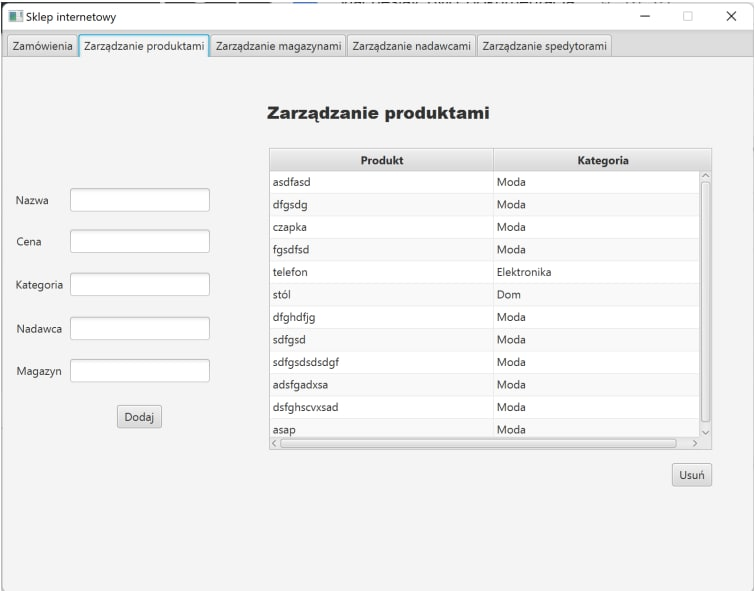
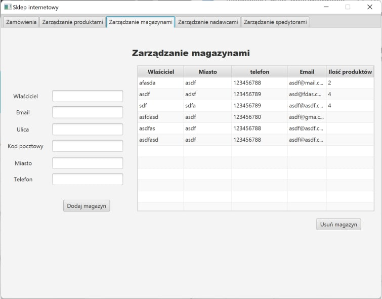
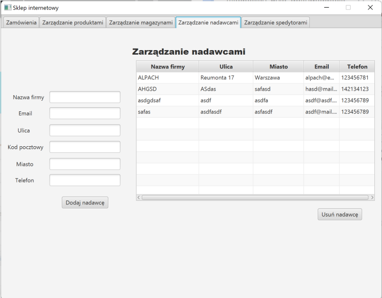
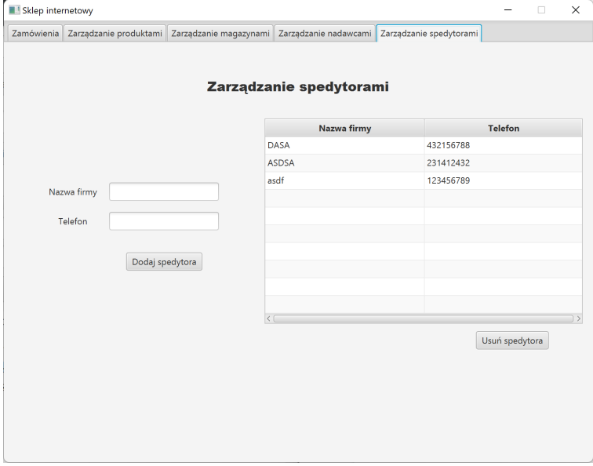

# Internet Shop

The theme of the project was to create an application for an online store that allows
the customer to buy the selected product from the selected category. 

A project was created with:
- JavaFX
- SQL
- generated with SceneBuilder xml code. 

## Application Screenshots 

- Login screen, where you can login or create new account.
  

- Sign up screen. Here client have to give their name, surname, email, phone number, address, city, zip code and login (username) and password.

- Home screen. Here client can buy a product in chosen category.

- Admin screen with orders. Here admin can send the order with chosen date and shipper.

- Admin screen for product managing. Here admin can add a product with specified price, category, supplier and warehouse or delete it. 

- Admin screen for warehouses managing. Here admin can add a warehouse with specified owner, owner's email, street, zip code, city and phone or delete it. 

- Admin screen for suppliers managing. As well as in the previous point here admin can add a supplier and some info about him or delete one.

- Admin screen for shippers managing. Here admin can add name of the company and phone.

